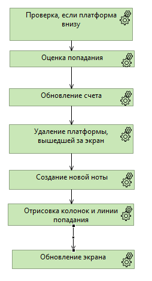

# DEV - Создание игрового цикла
Теги: #dev #mechanics

Диаграмма обновления игрового состояния в каждом цикле while, который находится в main().

Связанные темы:
[[DEV - Тестирование игры]] DEV - Тестирование игры